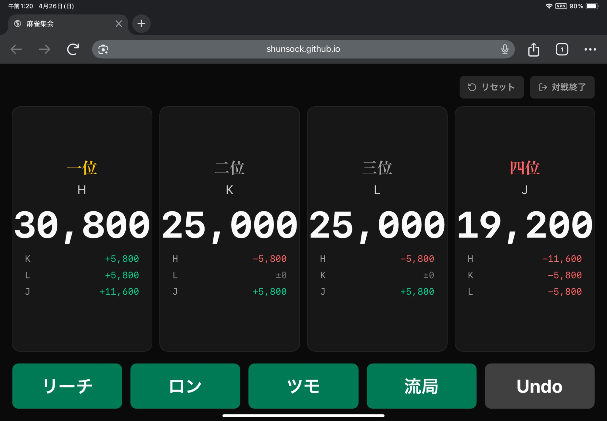
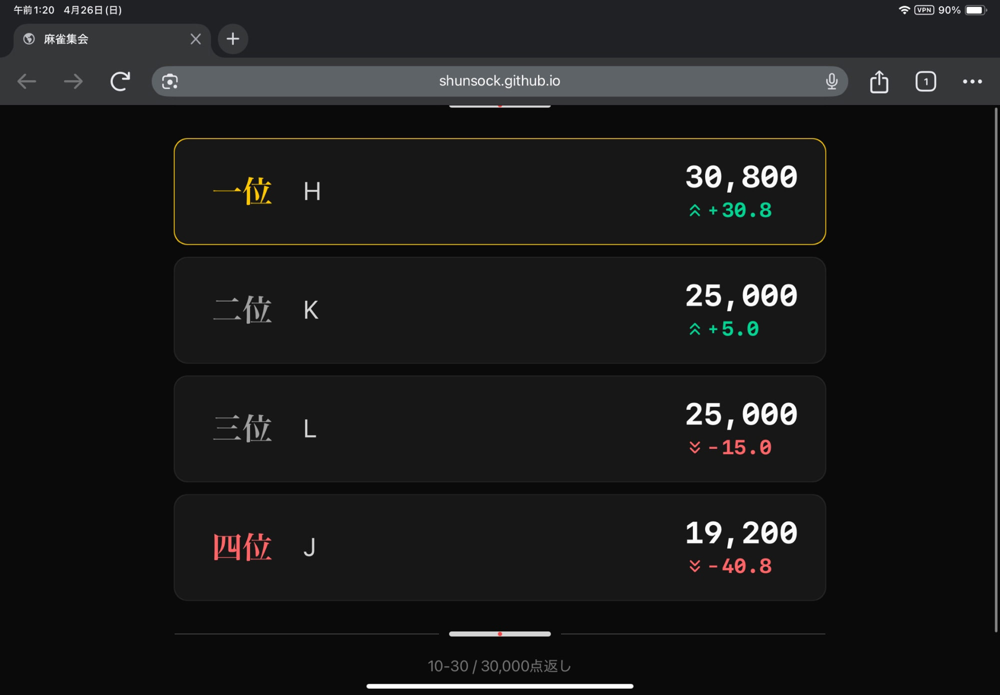

# 麻雀集会

リアル麻雀 (4人打ち) 用のスコアダッシュボード。自動卓の隣に大画面を置いて、4人分の持ち点・順位・点差をリアルタイムに表示します。

**https://shunsock.github.io/mahjong_meetup/**

## スクリーンショット

| 対局中 | 結果画面 |
|:---:|:---:|
|  |  |

## 機能

- 4人分の持ち点・順位・点差を大画面向けに表示
- ロン / ツモ / 流局 / リーチ をボタン操作で入力
- 翻・符セレクターによる点数自動算出
- 順位点 (ウマ) ・返し点 (オカ) の設定と最終スコア計算
- Undo で直前の操作を取り消し
- オフライン動作 (ネットワーク不要)

## Getting Started

[docs/getting_started.md](docs/getting_started.md) を参照してください。

## 開発

[docs/develop.md](docs/develop.md) を参照してください。

## 技術スタック

| 項目 | 選定 |
|---|---|
| 言語 | TypeScript 7 |
| フレームワーク | React 19 |
| ビルドツール | Vite 8 |
| スタイリング | Tailwind CSS 4 |
| テスト | Vitest 4 |
| パッケージマネージャ | pnpm |
| 開発環境 | Nix (devShell) |
| ホスティング | GitHub Pages |

## ライセンス

[MIT](LICENSE)
